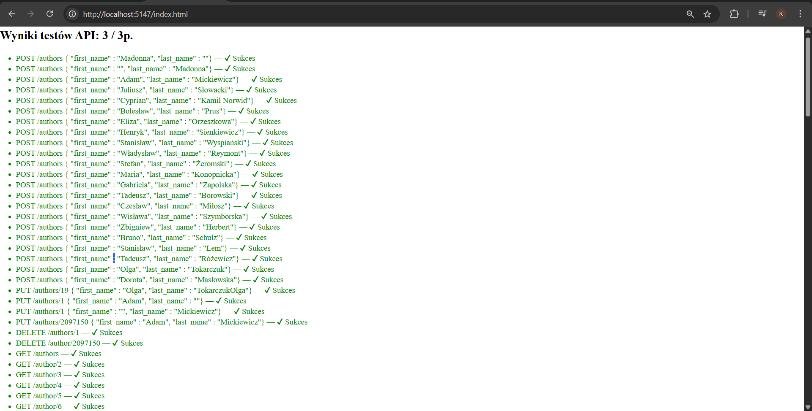
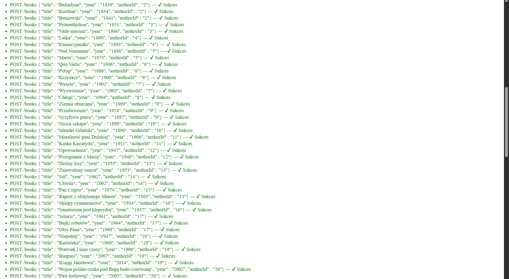

# Library API

Proste REST API zrealizowane w ASP.NET Core (.NET 8) z użyciem Entity Framework Core i SQLite.

Wydzielenie logiki mapowania do osobnej warstwy (Mapping) zwiększa czytelność kontrolerów, separuje odpowiedzialności i ułatwia dalszy rozwój oraz testowanie aplikacji bez wpływu na publiczne API.

Projekt implementuje operacje CRUD dla encji Author i Book.
Struktura endpointów i format odpowiedzi są zgodne z dostarczonymi testami automatycznymi (wynik: 3/3).

Uwaga: w trybie deweloperskim baza danych jest resetowana przy starcie aplikacji, aby zapewnić powtarzalne i jednoznaczne wyniki testów automatycznych.

## Widoki aplikacji

### Wyniki testów automatycznych







## Uruchomienie projektu

1. Zbuduj projekt:
   ```bash
   dotnet build

2. Uruchom aplikację:
  dotnet run

3. Po uruchomieniu aplikacji testy automatyczne dostępne są pod adresem:
http://localhost:5147/index.html